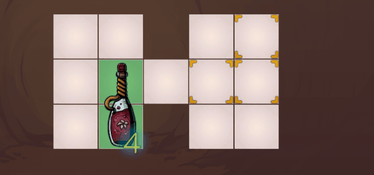
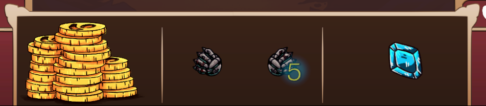
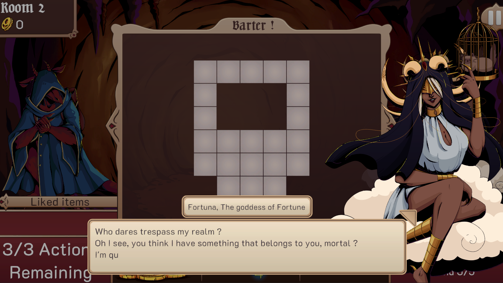

Fool's Gold is a turn based batering roguelike game where a merchant has to sell items to traverse the depths of hell.  

For this game I worked as a Game and Content designer. I did additionnal work on programming and laying out the main game structure, and polishing most parts of the game. 

The game main constraints and goals were heavily inspired by the main themes of the game jam it was submitted in : the **Boss Rush Jam** with the theme **Exchange**. I aimed to make a strategy game where the player has to manage their main resources by trading them away to the enemy. The player does not have a health bar on its own, but has a limited time to create as much wealth as possible to sell to the bosses. As a result, I tried to put a heavy emphasis on having to find synergies and preserving resources for future fights. 

The main way of choosing resources is a 3-way stack system. When you play an item from a stack, the 2 items on the stacks go at the bottom of them, allowing for complex choice making. I wanted to experiment with a less classical "card hand" formula.  

I wrote over 70 barks for the bosses, and wrote miscellaneous descriptions for over 80 items and tooltips.  

The game is playable on a browser [on itch.io](https://ayperosia.itch.io/fools-gold).

In order to pitch and showcase the project to our team, I wrote a small presentation summing up the systems and goals of the game, which is available here : [Presentation](https://docs.google.com/presentation/d/1KZ5wtGfDJs4BLFMmTzko2bkxoo9EDe2ajNZvtuqWZYs/edit)

A bigger game document is also available to read here : [GDD](https://docs.google.com/document/d/1mEv0S4rG_MX6Xw7JWYu01h9KuaWqgLSy5VxWMFu6SDU/edit?usp=sharing)
