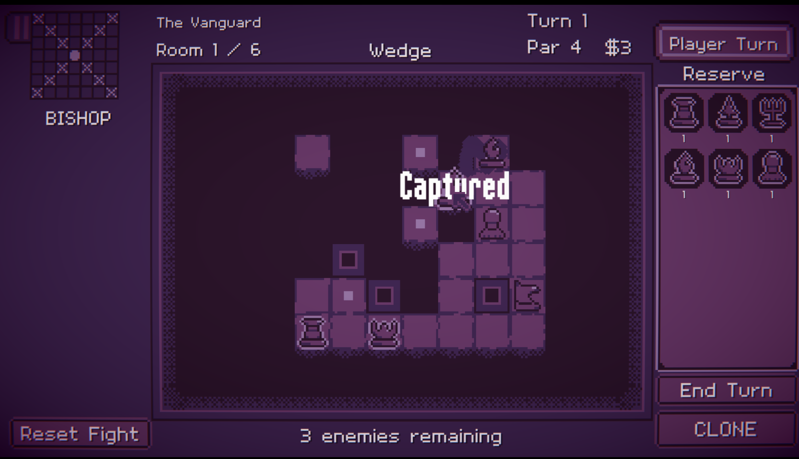

MEGACHESS is a chess-based dungeon crawler, with roguelike elements. 

Build your army by capturing opponent pieces, dive across 3 areas with over 50 rooms, and defeat the black king with over 7 different classes and abilities.
 


My goal for the project was to create structures which would allow me to practice on creating levels, units, and abilities in a short time span. I aimed towards making the systems as flexible as possible, 
and decided to expand on the chess genre, to try and capture the feeling of solving chess puzzles but with different starting pieces at the same time. The main inspirations are Mosa Lina and Into the Breach.

The game is playable on a browser [on itch.io](https://gorglomux.itch.io/megachess).

Made in 14 days for the Acerola Game Jam.
The game has gained traction from inside and outside the jam, and I will continue the development of the game, and aim to release a full version in the future.
