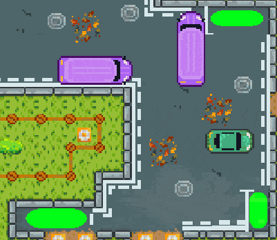
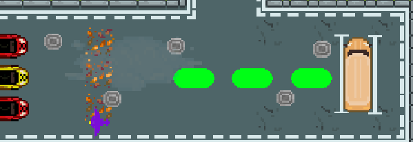

*Nice park !* is a puzzle game where the player have to park cars in a small place. 
The goal of the game is to fill all the green spots by all means possible. This mean parking different cars, or pushing others, while avoiding already parked cars. 

The game has 13 levels, with 5 different cars with varied gameplay and physics.

For this game I designed the levels, main mechanics, developped and implemented the car physics and parking detection, as well with most of the asset implementation and sound effects. 

The goal was to try to imitate the experience of trying to park in a stressful spot in real life. Doing your maneuver but ending up with the car in the middle of the road, bumping into other cars and try to fix it...  

The major design challenge in the game was to make the game a bit frustrating, while staying fun and engaging. To help with that, I tinkered a lot with parking detection leniency and general vehicle maniability.

You can check a small video of the gameplay here :


Made for the Ludum Dare Jam 54 with the theme *Limited Space*.  

We finished the jam by having over 200 ratings and by being ranked 97th overall out of 1590 entries !