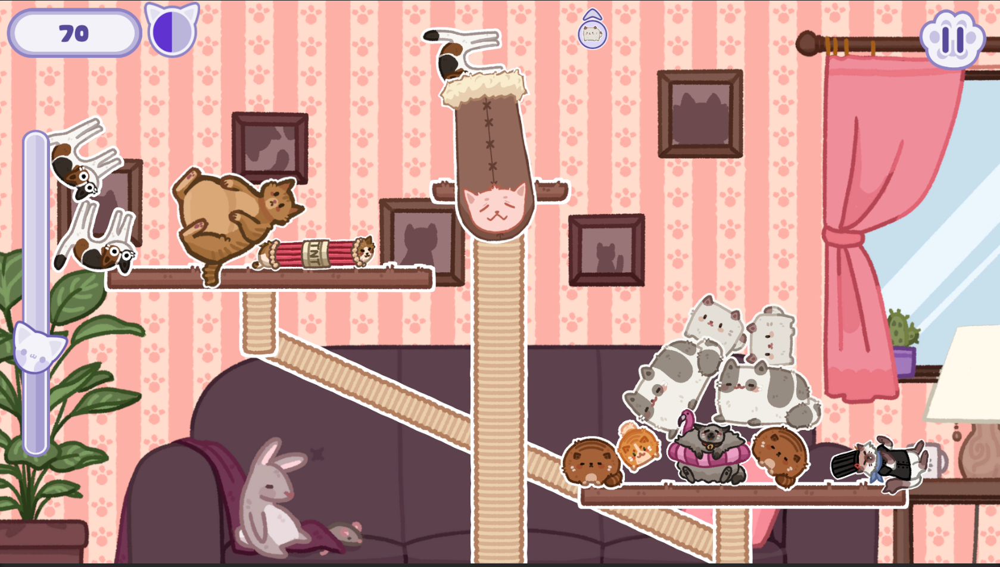

The Tower of catastrophe is an casual physics-based puzzle game where the player has to manage cats rapidly falling from the sky, and put them on a scale. 
The cats have different powerups, which makes the game tricky to manage.

For this game I worked as a Game and Content designer, implemented all visual and sound assets as well as balanced the game, along with developping most of the UI.  

One of the challenge I had to solve was that as there is a lot of different cats with varied powerups (22 in total), I had to figure out a way to incrementally add difficulty, while keeping the game time pretty low (I was aiming for a 7/8 minute game in average). The cats also took a lot of space on screen, and there was a need to reduce clutter while keeping the player alert at most time. 

I came up with a short round system with a timer that makes the game harder as the round goes on, then resets for the next one, while introducing a new cat that will spawn on the next round.
This way, the game starts with only 3 cats without powerups that can spawn, then it gradually adds up every round until 13 different cats. That way the player has more time to figure out which cat does what. Also, having to deal with less cat types can make very interesting situations where a cat sometimes is not an issue when alone, but become way harder to deal with when in group.   

Moreover, this round system makes it so each time you launch a new game, the cats you see are wildly different from the ones you had in a previous game, which adds a lot of replay value.

It was important to me that the game felt good and cosy to play, therefore I put a lot of emphasis on polishing it by adding particle effects, 
and by taking the time to add basic animation and tweens for the User Interface, Main menu, and background. 

The game is playable on a browser [on itch.io](https://ayperosia.itch.io/tower-of-catastrophe), and the [source code](https://github.com/ThunderJams/GameOffJam2023) is also avaliable on github. 

To get started with the project, I made a [Game Design Document](https://docs.google.com/document/d/1NFU9h1Buusn7iRRbbFxXMZfDTwyCYejdFpgoEXmLpv0) that you can check out.

The project has been developed for the Game Off Jam 2023, and reached the 10th place in the Overall Category, out of 627 entries.
