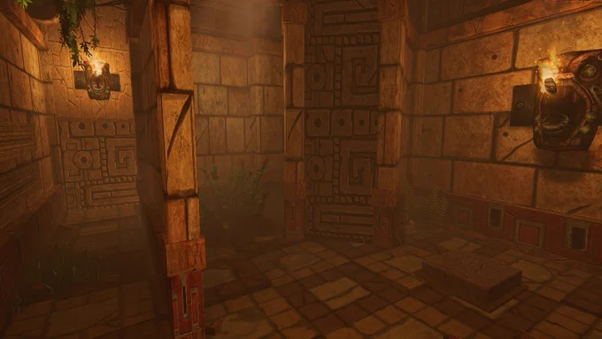

*Escapage* is a 20-minute escape game set in a maya environment. Players have to work their way inside a mayan temple and discover the riches of the place, while avoiding deadly traps. The game is designed for 3-8 players.

I worked on designing a way to condense some of the puzzles into a smaller area, to fit with more configuration of warehouses. 
I also worked on implementing different types of hand tracking for the newer headset we used (Quest 2 and Vive Focus 3).
I also helped reworking the end of the game as it was confusing for players . 