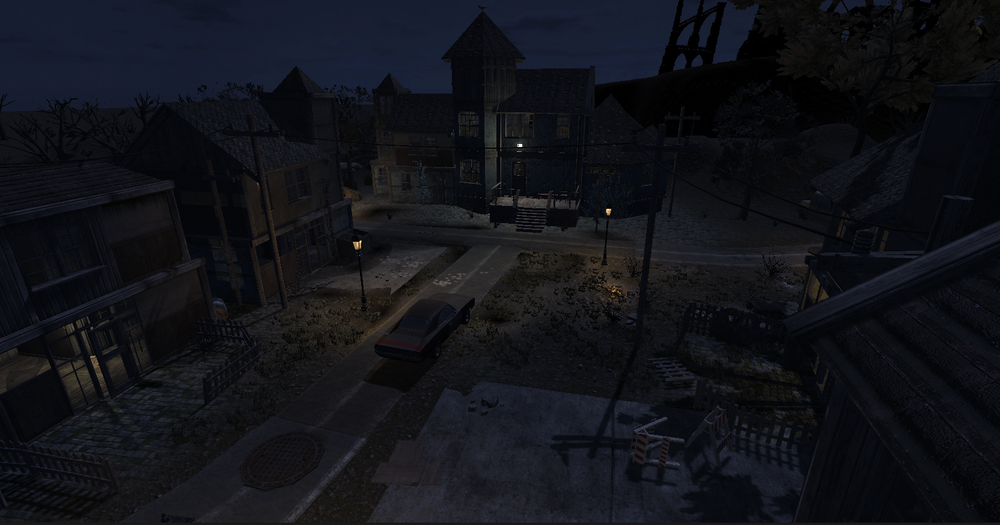
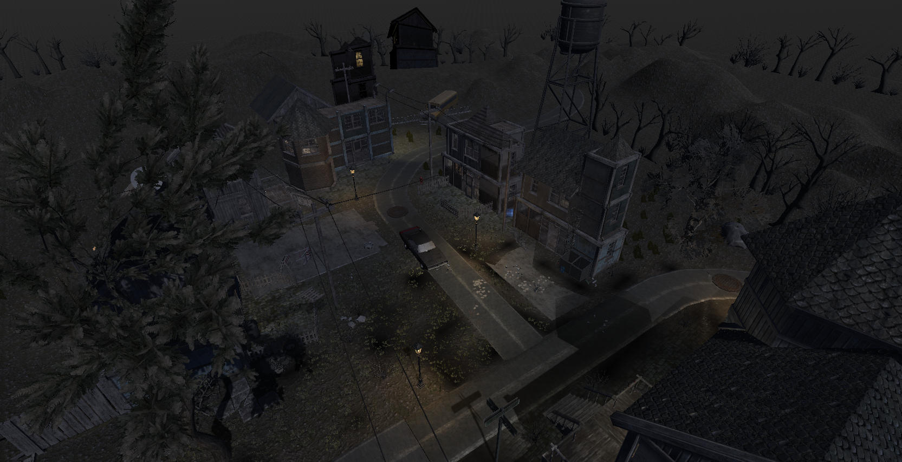

The day after is a Pve zombie shooter game set in an abandoned mansion and a dark village. The game had a moderate success in our VR rooms, and I was tasked to develop a second chapter for it. 
 

For this game I :
- Wrote the scenario and dialogue lines 
- Designed new enemies and a new boss 
- Designed and developped a more dynamic enemy spawning feature
- Designed a new level, then tailored it to fit with every room configuration of our venues
- Optimize the game for low-end vr devices
- Worked on compatibility for new headset and accessories for the first chapter

As the view of players in the game is relatively static, I used impostors to add details in the background without using too much resources. 